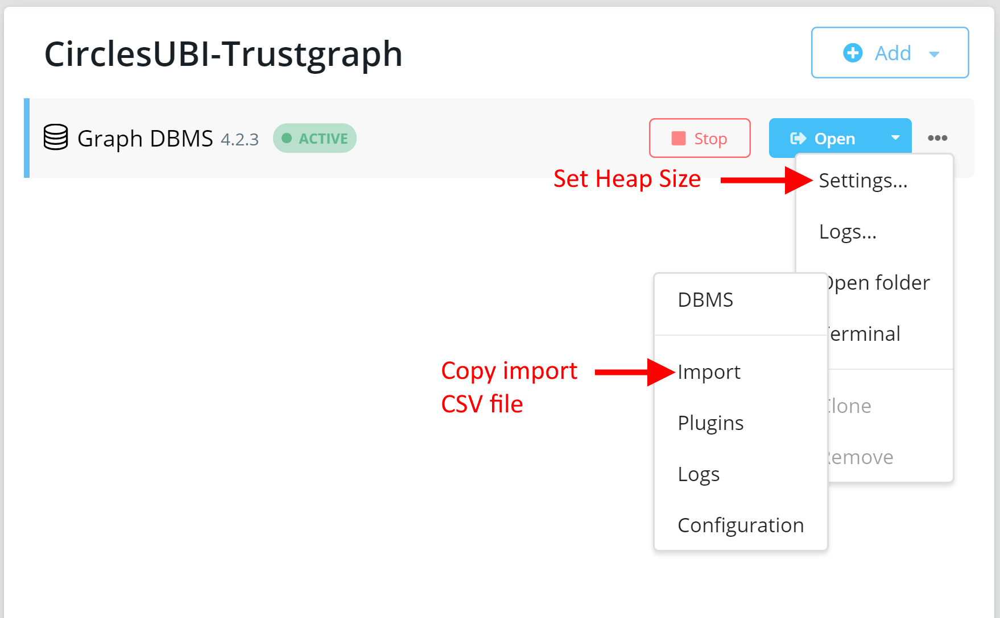

## Circles UBI Trustgraph Visualization and Shortest Path Calculation with Neo4j

(see https://gist.github.com/ice09/87509a1ecafd9ddd73e02c6ebc5b005d for quick overview)

This projects consists of two loosly related sub-projects:
* Circles UBI-Trustmonitor
  * Monitor the `Hub` Smart Contract for `Trust` Events and store them.
* Circles UBI-Trustgraph-Neo4j
  * Store the `truster`, `trustee`, `blockNumber` and `amount` in a running Neo4j database.
  * Offer a transitive payment (shortestPath) calculation API 

The Trustmonitor reads all `Trust` events of the `Hub` Smart Contract and calls an (external) service with the retrieved data.

The Trustgraph accepts incoming requests with `truster`, `trustee`, `blockNumber` and `amount` data, stores this data into a Neo4j Graph Database and can calculate the shortest Trust-Path between two Users.

## Usage

### Setup

* Install [Neo4j](https://neo4j.com/) 
* Create a database with user `neo4j` and password `123654789`, listening on default port/protocol `bolt://localhost:7687`
 * Optionally increase Heap size use settings `dbms.memory.heap.initial_size=2G` and `dbms.memory.heap.max_size=4G`
* Copy `trustgraph_*.csv` from this repo root to the import folder.

* Use the Cypher statements from [this gist](https://gist.github.com/ice09/87509a1ecafd9ddd73e02c6ebc5b005d) for commands to import the data from the CSV and set indexes.

### Operation

#### Using Docker

* Execute `docker run -d -p 8889:8889 --name circlesubi-trustgraph ice0nine/circlesubi-trustgraph:latest`

#### Using IDE (IntelliJ)

* Change `host.docker.internal` to `localhost` in `application.properties`
* Build with Maven and start `UserTrustGraphApplication`

When starting the application, the Monitor listens from Block `start.block` in `application.properties`. Though it's possible to start with 12529458, which is the deployment blocknumber of the `Hub` Smart Contract in the xDai Chain, the processing would then take some hours to catch up with the current state.  
Therefore, it is much better to import the provided file `trustgraph_14487468.csv` into Neo4j directly, which takes ~30 secs and then set the `start.block` to 14487468.

## Circles UBI-Trustmonitor

After starting the application, a scheduler will run which monitors the Events of the `Hub` Smart Contract for `Trust` Events. If an event is found, a REST POST call is used to store the data in an external data source. In this demo, the external data source is the Trustgraph service.

## Circles UBI-Trustgraph Neo4j

The Trustgraph service provides an API which is described at http://localhost:8889/swagger-ui.html

The most interesting API call offered is the calculation of the shortest path (with transitive transfers) between two users:

`curl -X GET "http://localtest.me:8889/trust/0x249fa3ecd95a53f742707d53688fcafbbd072f33/0x945CaC6047B1f58945ed2aafA5BaeD96A31faa4c/50" -H "accept: */*"`

